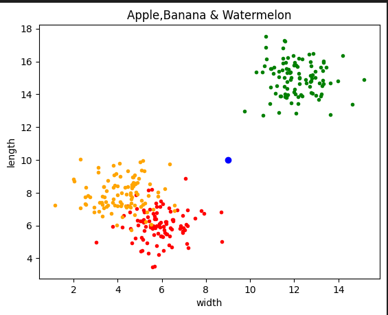

# Machin learning(KNN Algorithm)


simple projects using KNN algorithm with python.


## python

This project is written in Python version 3.10.8

I have used the [matplotlib](https://matplotlib.org/) and [Numpy](https://numpy.org/) 


### **My Project**
 ---

**First**   :   **Implement the KNN algorithm for 3 classes,Apple,Banana and watermelon**


### **How to Run**
excecute this command in terminal:
 ```
 main_2.ipynb
  ```
   

### **result**


---



